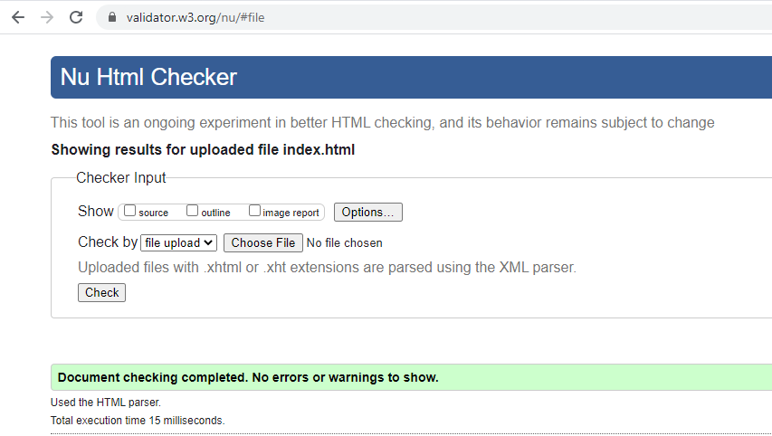
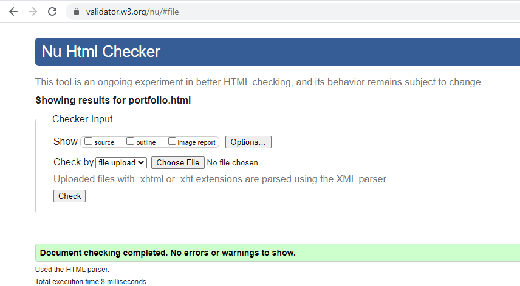
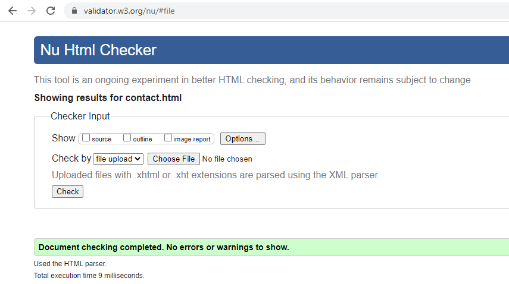

# Project Name
> Portfolio Website

## Table of contents
* [General info](#general-info)
* [Screenshots](#screenshots)
* [Code Examples](#code-examples)
* [Features](#features)
* [Status](#status)
* [Contact](#contact)

## General info
This project is an ongoing one to create my portfolio page.  Future updates will include actions, animations, iamges, and
areas of experience.

## Screenshots

## Code Validation

## Code Examples
Examples of usage:
`<body class="d-flex flex-column h-100">

    <nav class="navbar navbar-expand-md bg-dark navbar-dark">        
        <a class="navbar-brand" href="#">Corey Colbert</a>        
        <button class="navbar-toggler" type="button" data-toggle="collapse" data-target="#collapsibleNavbar">
          
        </button>
      
        

          <ul class="navbar-nav">
            <li class="nav-item">
              <a class="nav-link" href="index.html">Home</a>
            </li>
            <li class="nav-item">
              <a class="nav-link" href="portfolio.html">Portfolio</a>
            </li>
            <li class="nav-item">
              <a class="nav-link" href="contact.html">Contact</a>
            </li>
          </ul>
        

      </nav>`

## Features
List of features ready and TODOs for future development
* Accessible web interaction
* Easy page navigation
* Contact form

To-do list:
* Site expansion
* Add content
* Add animations

## Status
Release 1.0

Project is: _unfinished_ Project was designed as a homework assignment for a boot camp class.  This is the initial submission for the assignment.

## Contact
Created by [Corey Colbert](cdcolbert10@gmail.com) - feel free to contact me!